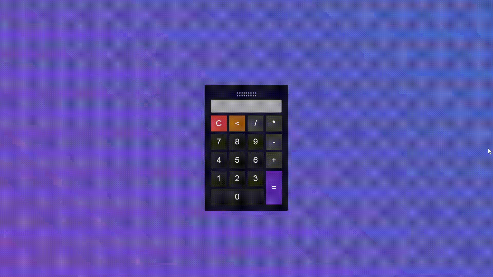
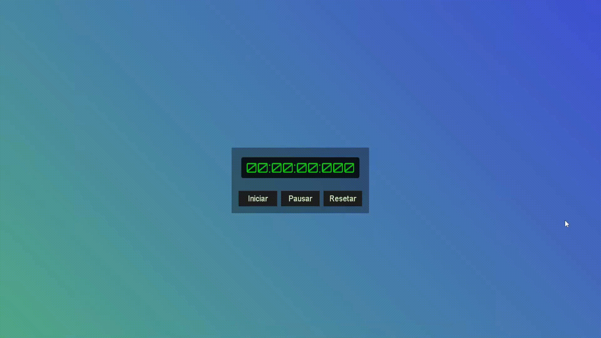

# Projetos:

## DEV:

1. Calculadora simples - Desenvolvido com HTML/CSS/JavaScript

    

2. Cronômetro - Desenvolvido com HTML/CSS/JavaScript

    

3. Relógio Analógico - (Tema - World of Warcraft - Lich King) - Desenvolvido com HTML/CSS/JavaScript 

    

-------------------------------------------- 

Por: Bianca Camargo 
